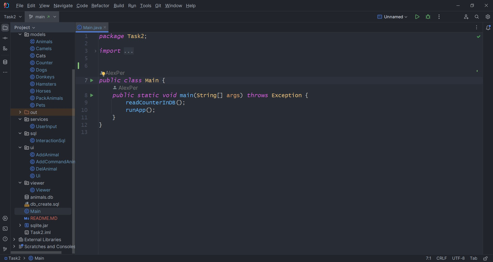
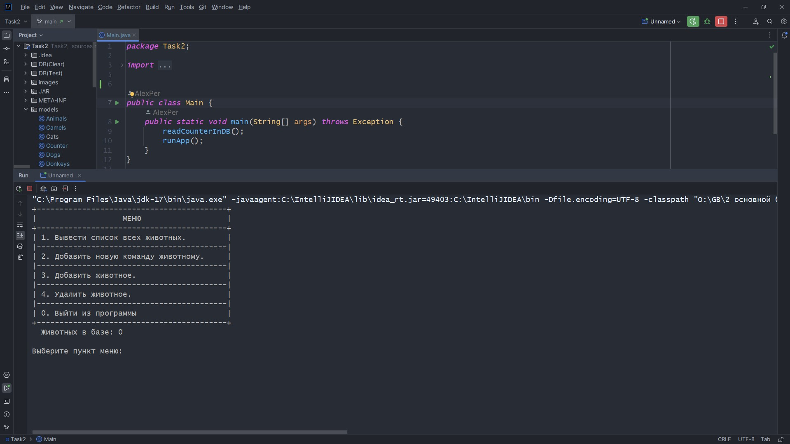
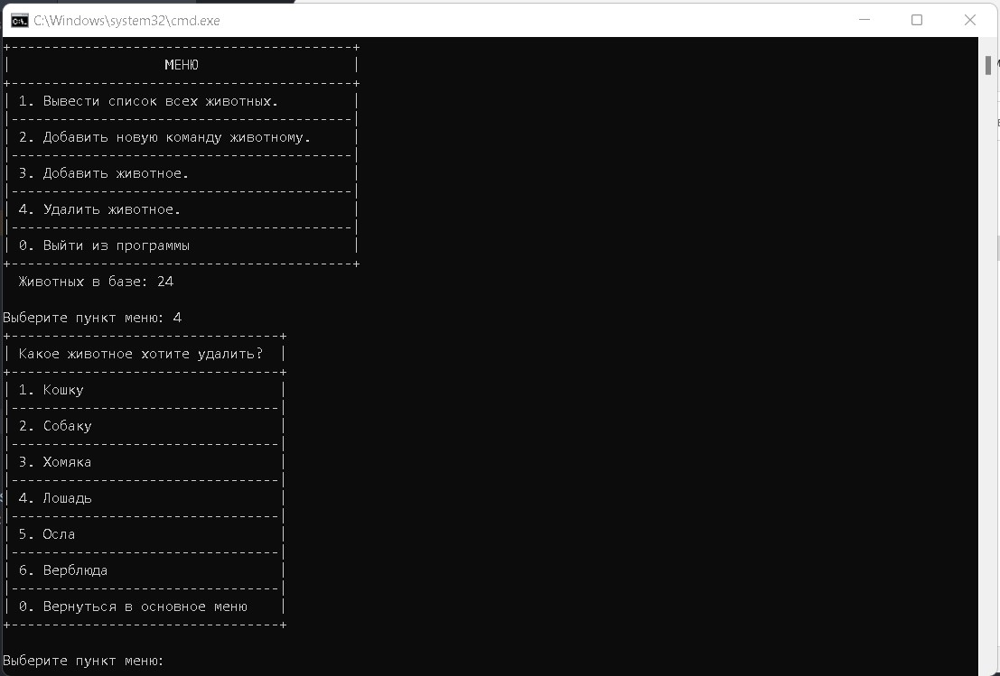

#  Часть вторая итоговой работы по специализации.
## Пункты с 13 по 15.

В данной папке (Task2) находятся файлы проекта.
Здесь же находятся скрипт для создания тестовой базы "db_create.sql" и сама тестовая база "animals.db".
А так же библиотека драйвера JDBC:SQLite, файл "sqlite.jar"
В этом проекте впервые попробовал использовать базу SQLite в связке с Java.

В папках [DB(Clear)](./DB(Clear)) и [DB(Test)](./DB(Test)) ноходятся пустая и тестовая базы соответственно.

В папке [JAR](./JAR) находится скомпилированный JAR файл проекта с [файлом](./JAR/StartJar.bat) для запуска в среде
ОС Windows тестовой базой (база должна находится в одной папке с JAR файлом и называться animal.db)

Проект создавался в программе INTELIJ IDEA и на других IDE не тестировался.

Скриншот запущенного в консоли windows JAR файла проекта.

